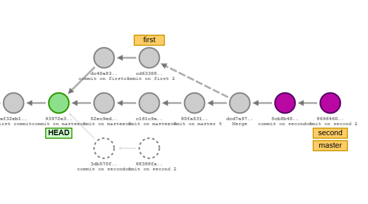
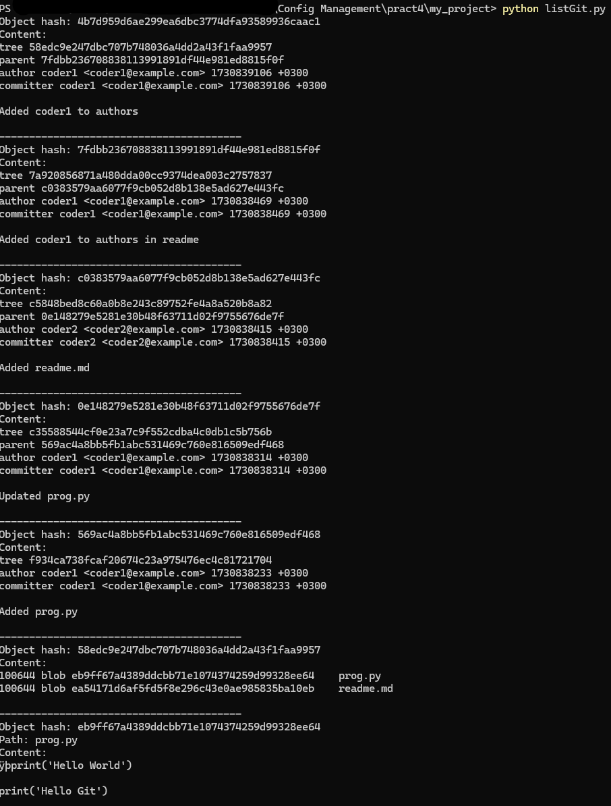

# Практическое занятие №4. Системы контроля версий

Ерченков А. А. - ИКБО-62-23

## Задание 1
```bash
$ git commit -am "commit on master 1"
$ git commit -am "commit on master 2"
$ git checkout -b first HEAD~1
$ git commit -am "commit on first 1"
$ git commit -am "commit on first 2"
$ git checkout master
$ git commit -am "commit on master 3"
$ git commit -am "commit on master 4"
$ git checkout -b second HEAD~3
$ git commit -am "commit on second 1"
$ git commit -am "commit on second 2"
$ git checkout master
$ git merge first
$ git checkout second
$ git rebase master
$ git checkout master
$ git merge second
$ git checkout HEAD~6
```



## Задание 2

```bash
$ git init
Initialized empty Git repository in C:/sample/pract4/.git/

$ git config user.name "coder1"
$ git config user.email "coder1@example.com@"

$ echo "print('Hello World!')" > prog.py
$ git status
On branch master

No commits yet

Untracked files:
  (use "git add <file>..." to include in what will be committed)
        prog.py

$ git add prog.py
$ git status
On branch master

No commits yet

Changes to be committed:
  (use "git rm --cached <file>..." to unstage)
        new file:   prog.py

$ git commit -m "Add prog.py with some data"
[master (root-commit) f32eac5] Add prog.py with some data
 1 file changed, 0 insertions(+), 0 deletions(-)
 create mode 100644 prog.py

$ git log
commit f32eac568ea11bcd907dd56448913821d10297d9 (HEAD -> master)
Author: coder1 <coder1@example.com>
Date:   Tue Nov 5 22:41:26 2024 +0300

    Add prog.py with some data
```

## Задание 3
```bash
$ mkdir my_project
$ cd my_project
$ git init
$ echo "print('Hello World')" > prog.py
$ git config user.name "coder1"
$ git config user.email "coder1@example.com"
$ git add prog.py
$ git commit -m "Added prog.py"
[master (root-commit) 569ac4a] Added prog.py
 1 file changed, 0 insertions(+), 0 deletions(-)
 create mode 100644 prog.py
$ cd ..

$ git clone --bare my_project server.git

$ cd my_project
$ git remote add server ../server.git
$ echo "print('Hello Git')" >> prog.py
$ git add prog.py
$ git commit -m "Updated prog.py"
[master 0e14827] Updated prog.py
 1 file changed, 0 insertions(+), 0 deletions(-) 
$ git push server master
Enumerating objects: 5, done.
Counting objects: 100% (5/5), done.
Delta compression using up to 20 threads
Compressing objects: 100% (2/2), done.
Writing objects: 100% (3/3), 288 bytes | 288.00 KiB/s, done.
Total 3 (delta 0), reused 0 (delta 0), pack-reused 0 (from 0)
To ../server.git
   569ac4a..0e14827  master -> master
$ cd ..

$ git clone server.git coder2_project
$ cd coder2_project
$ git config user.name "coder2"
$ git config user.email "coder2@example.com"
$ echo "Program: Hello world" > readme.md
$ git add readme.md
$ git commit -m "Added readme.md"
[master c038357] Added readme.md
 1 file changed, 0 insertions(+), 0 deletions(-)
 create mode 100644 readme.md
$ git push origin master
Enumerating objects: 4, done.
Counting objects: 100% (4/4), done.
Delta compression using up to 20 threads
Compressing objects: 100% (2/2), done.
Writing objects: 100% (3/3), 308 bytes | 308.00 KiB/s, done.
Total 3 (delta 0), reused 0 (delta 0), pack-reused 0 (from 0)
To C:/pract4/server.git
   0e14827..c038357  master -> master
$ cd ../my_project

$ git pull server master
remote: Enumerating objects: 4, done.
remote: Counting objects: 100% (4/4), done.
remote: Compressing objects: 100% (2/2), done.
remote: Total 3 (delta 0), reused 0 (delta 0), pack-reused 0 (from 0)
Unpacking objects: 100% (3/3), 288 bytes | 57.00 KiB/s, done.
From ../server
 * branch            master     -> FETCH_HEAD
   0e14827..c038357  master     -> server/master
Updating 0e14827..c038357
Fast-forward
 readme.md | Bin 0 -> 46 bytes
 1 file changed, 0 insertions(+), 0 deletions(-)
 create mode 100644 readme.md
$ echo "Authors: coder1" >> readme.md
$ git add readme.md
$ git commit -m "Added coder1 to authors in readme"
[master 7fdbb23] Added coder1 to authors in readme
 1 file changed, 0 insertions(+), 0 deletions(-)
$ git push server master
Enumerating objects: 5, done.
Counting objects: 100% (5/5), done.
Delta compression using up to 20 threads
Compressing objects: 100% (3/3), done.
Writing objects: 100% (3/3), 339 bytes | 339.00 KiB/s, done.
Total 3 (delta 0), reused 0 (delta 0), pack-reused 0 (from 0)
To ../server.git
   c038357..7fdbb23  master -> master
$ cd ../coder2_project

$ echo "Authors: coder2" > readme.md
$ git add readme.md
$ git commit -m "Added coder2 to authors"
$ git push origin master
 ! [rejected]        master -> master (fetch first)
error: failed to push some refs to 'C:/pract4/server.git'
hint: Updates were rejected because the remote contains work that you do not
hint: have locally. This is usually caused by another repository pushing to
hint: the same ref. If you want to integrate the remote changes, use
hint: 'git pull' before pushing again.
hint: See the 'Note about fast-forwards' in 'git push --help' for details.
$ git pull origin master
From C:/pract4/server
 * branch            master     -> FETCH_HEAD
warning: Cannot merge binary files: readme.md (HEAD vs. 4b7d959d6ae299ea6dbc3774dfa93589936caac1)
Auto-merging readme.md
CONFLICT (content): Merge conflict in readme.md
Automatic merge failed; fix conflicts and then commit the result.
$ echo "Program: Hello world!" > readme.md
$ echo "Authors: coder1" >> readme.md
$ echo "Authors: coder2" >> readme.md
$ git add readme.md
$ git commit -m "Resolve conflict, add coder2 to authors"
[master 149ebfa] Resolve conflict, add coder2 to authors
$ git push origin master
Enumerating objects: 17, done.
Counting objects: 100% (17/17), done.
Delta compression using up to 20 threads
Compressing objects: 100% (9/9), done.
Writing objects: 100% (11/11), 1.12 KiB | 1.12 MiB/s, done.
Total 11 (delta 1), reused 0 (delta 0), pack-reused 0 (from 0)
To C:/pract4/server.git
   4b7d959..149ebfa  master -> master

$ git log
commit 149ebfada5aade0e0135586a0f87f68b883eb153 (HEAD -> master, origin/master, origin/HEAD)
Merge: e839ccb 4b7d959
Author: coder2 <coder2@example.com>
Date:   Tue Nov 5 23:41:50 2024 +0300

    Resolve conflict, add coder2 to authors

commit e839ccb348d040153ce3241492656f0ea3d963e6
Author: coder2 <coder2@example.com>
Date:   Tue Nov 5 23:40:14 2024 +0300

    Added coder2 to authors

commit 4b7d959d6ae299ea6dbc3774dfa93589936caac1
Author: coder1 <coder1@example.com>
Date:   Tue Nov 5 23:38:26 2024 +0300

    Added coder1 to authors

commit d848dfa8a91893a6a21956622f6174bb5a7dbb01
Merge: 4bf3912 7fdbb23
Author: coder2 <coder2@example.com>
Date:   Tue Nov 5 23:35:32 2024 +0300

    Fixed merging issues

commit 4bf39122066032e8c749ae5309400d94021c0c6e
Author: coder2 <coder2@example.com>
Date:   Tue Nov 5 23:28:32 2024 +0300

    readme.md

commit 7fdbb236708838113991891df44e981ed8815f0f
Author: coder1 <coder1@example.com>
Date:   Tue Nov 5 23:27:49 2024 +0300

    Added coder1 to authors in readme

commit c0383579aa6077f9cb052d8b138e5ad627e443fc
Author: coder2 <coder2@example.com>
Date:   Tue Nov 5 23:26:55 2024 +0300

    Added readme.md

commit 0e148279e5281e30b48f63711d02f9755676de7f
Author: coder1 <coder1@example.com>
Date:   Tue Nov 5 23:25:14 2024 +0300

    Updated prog.py

commit 569ac4a8bb5fb1abc531469c760e816509edf468
Author: coder1 <coder1@example.com>
Date:   Tue Nov 5 23:23:53 2024 +0300

    Added prog.py
```

## Задание 4
```python
import subprocess

def listAllGitObjects():
    result = subprocess.run(
        ["git", "rev-list", "--all", "--objects"],
        capture_output=True,
        text=True,
        check=True)
    
    for line in result.stdout.splitlines():
        parts = line.split()
        obj_hash = parts[0]
        obj_path = parts[1] if len(parts) > 1 else None

        print(f"Object hash: {obj_hash}")
        if obj_path:
            print(f"Path: {obj_path}")

        obj_content = subprocess.run(
            ["git", "cat-file", "-p", obj_hash],
            capture_output=True,
            text=True,
            check=True)
        
        print("Content:")
        print(obj_content.stdout)
        print("-" * 40)

listAllGitObjects()
```

